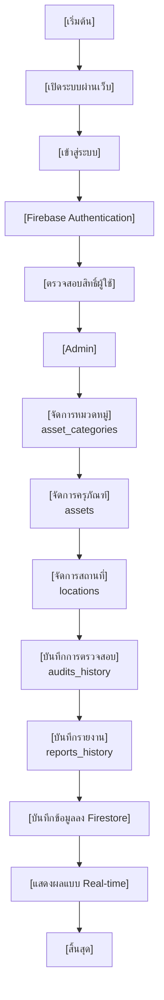

```mermaid
graph TD
    A["[เริ่มต้น]"] --> B["[เปิดระบบผ่านเว็บ]"]
    B --> C["[เข้าสู่ระบบ]"]
    C --> D["[Firebase Authentication]"]
    D --> E["[ตรวจสอบสิทธิ์ผู้ใช้]"]
    E --> F["[Admin]"]
    F --> G["[จัดการหมวดหมู่]<br/>asset_categories"]
    G --> H["[จัดการครุภัณฑ์]<br/>assets"]
    H --> I["[จัดการสถานที่]<br/>locations"]
    I --> J["[บันทึกการตรวจสอบ]<br/>audits_history"]
    J --> K["[บันทึกรายงาน]<br/>reports_history"]
    K --> L["[บันทึกข้อมูลลง Firestore]"]
    L --> M["[แสดงผลแบบ Real-time]"]
    M --> N["[สิ้นสุด]"]
```
