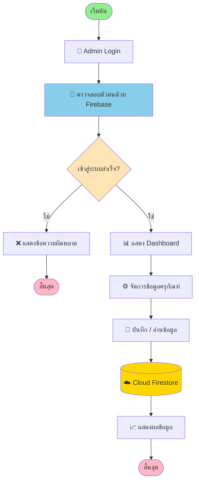

# University-Asset-Management System Flowchart

```mermaid
flowchart TD
    Start([เริ่มต้น])
    Login["🔑 Admin Login"]
    Firebase["🔐 ตรวจสอบตัวตนด้วย Firebase"]
    Decision{เข้าสู่ระบบสำเร็จ?}
    Error["❌ แสดงข้อความผิดพลาด"]
    End1([สิ้นสุด])
    Dashboard["📊 แสดง Dashboard"]
    Manage["⚙️ จัดการข้อมูลครุภัณฑ์"]
    ReadWrite["💾 บันทึก / อ่านข้อมูล"]
    Firestore[(☁️ Cloud Firestore)]
    Display["📈 แสดงผลข้อมูล"]
    End2([สิ้นสุด])
    
    Start --> Login
    Login --> Firebase
    Firebase --> Decision
    Decision -->|ไม่| Error
    Error --> End1
    Decision -->|ใช่| Dashboard
    Dashboard --> Manage
    Manage --> ReadWrite
    ReadWrite --> Firestore
    Firestore --> Display
    Display --> End2
    
    style Start fill:#90EE90
    style End1 fill:#FFB6C6
    style End2 fill:#FFB6C6
    style Firebase fill:#87CEEB
    style Firestore fill:#FFD700
    style Decision fill:#FFE4B5
```
